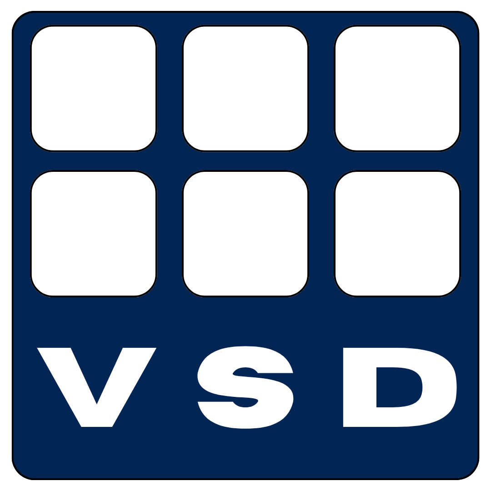
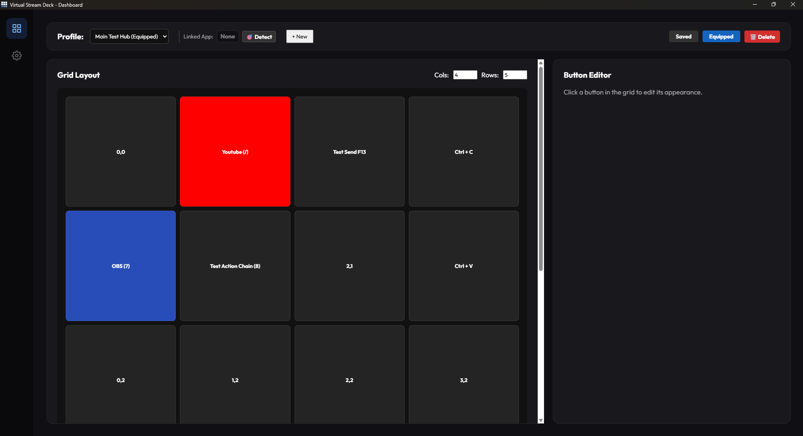

<p align="center">
  
</p>

# Virtual Stream Deck

**Virtual Stream Deck** is a fully software-based alternative to expensive hardware macro pads. It allows you to create custom buttons, automate keystrokes, and control OBS Studio natively, all through a lightweight floating interface.

Built with **Tauri (Rust) and React**, it is designed to be highly performant, consuming minimal system resources so your games run smoothly.

 _Dashboard_

## Key Features

- **Floating On-Screen Display (OSD):** A customizable, transparent grid of buttons that overlays your games or desktop. You can summon or hide it instantly using a global hotkey (e.g., `Ctrl + Shift + D`) without having to Alt-Tab.
- **Active App Tracking:** Bind different profiles to specific applications. Virtual Stream Deck detects your active window and will automatically swap to the correct profile when you click into a specific game or app.
- **OBS Studio Integration:** Natively connects to OBS via WebSocket 5.0. Change scenes, toggle sources, mute audio, and take screenshots with a single click.
- **Infinite Customization:**
  - Build grids ranging from simple 3x3 layouts to massive 12x12 setups.
  - Customize button labels, background colors, and icons.
  - Chain multiple actions together (macros) to execute sequentially.
- **Zero Telemetry, 100% Local:** All your profiles and settings are saved securely on your local machine.

## Tech Stack

- **Frontend:** React 19, TypeScript, Vite
- **Backend:** Tauri v2, Rust
- **Styling:** Vanilla CSS
- **OBS Integration:** `obs-websocket-js`

## etting Started

### Prerequisites

- [Node.js](https://nodejs.org/) (v18 or newer)
- [Rust](https://rustup.rs/) (for Tauri compilation)

### Running Locally

1. Clone the repository and install dependencies:

```bash
npm install
```

2. Start the development server (this will launch the Vite frontend and compile the Rust backend):

```bash
npm start
```

## 🎮 How to Use

1. **Open the Dashboard:** The main window allows you to configure your grid.
2. **Add Actions:** Click any square to assign macros, application shortcuts, media controls, or OBS triggers.
3. **Set your Hotkey:** Head to the Global Settings tab (gear icon) to set your OSD summon hotkey.
4. **Link Apps:** Create a new profile, hit the `🎯 Detect` button, and click into your favorite game to bind that profile to it.

## 🤝 Contributing

Contributions, issues, and feature requests are welcome! Feel free to check the issues page.
